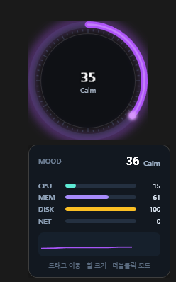

# Mood Ring Widget

A lightweight, always-on-top desktop **mood ring** for Windows. It samples your system load (CPU / memory / disk / network / battery), blends it into a single **composite score (0–100)**, and expresses that "mood" as a smoothly animated color ring — calm teal when idle, glowing red when your machine is on fire. 🔥

Built with **WPF on .NET 8**. Frameless, transparent, draggable, and tucked into the system tray.

<p align="center">
  
</p>
<p align="center"><sub>Sunset theme · score 35 (Calm) · hover detail panel with per-metric bars + sparkline</sub></p>

> 💛 **Support / 후원:** Toss Bank `1001-2269-0600` — every little bit keeps this project alive.

---

## ✨ Highlights

**Core**
- Frameless, transparent, top-most circular ring widget
- Composite score: `CPU·0.40 + MEM·0.30 + DISK·0.15 + NET·0.15`, with optional battery adjustment
- EMA smoothing (adjustable) for the displayed number; **raw score** drives color/emoji for snappy reactivity

**Visuals**
- **5 color themes** — Aurora · Sunset · Neon · Ocean · Mono — interpolated in HSV across the score
- **Eased color transitions** (`ColorAnimation`, ~360 ms) so the ring never "pops" between colors
- **Reactive glow + breathing pulse** — the higher the load, the stronger the glow and the faster the pulse
- A **comet** (glowing dot) trailing the progress arc, 60 tick marks, a highlight sheen, and a **rotating shimmer** when the mood hits *Heat*
- Center **mood label**: `Calm → Focus → Busy → Heat`

**Interaction**
- Display modes: **Score / Emoji / Text** (double-click to cycle)
- **Hover detail panel** — per-metric mini bars (CPU·MEM·DISK·NET) with live values + a **sparkline** of recent scores
- **Settings window** — themes, display mode, weights, smoothing, interval, idle opacity, and toggles, all applied **live**
- Drag to move · scroll wheel to resize · lock to pin in place

**System**
- **Auto-start** on Windows login (per-user `HKCU\…\Run`, no admin needed)
- **Click-through** mode (mouse passes through the widget to windows beneath)
- **Dynamic tray icon** colored by the current mood + context menu with live check states
- Settings persisted to `%AppData%\MoodRing\settings.json`

---

## 🎨 Color themes

| Theme  | Calm → Heat sweep                                   |
|--------|-----------------------------------------------------|
| Aurora | teal → lime → orange → red (default)                |
| Sunset | indigo → magenta → pink → orange → gold             |
| Neon   | cyan → mint → yellow → rose → orchid                |
| Ocean  | sky → cyan → teal → amber → red                     |
| Mono   | slate → silver → white → amber → coral (low-key)    |

Each theme maps **low load = cool/calm** and **high load = intense**, interpolated along the shortest HSV hue path.

---

## 🧮 Composite score

1. Sample metrics via `PerformanceCounter` + `PowerStatus`
2. Weighted sum: `CPU·w_cpu + MEM·w_mem + DISK·w_disk + NET·w_net` (weights configurable)
3. Battery adjustment (optional): charging `−5`, below 20% `+10`
4. Clamp to `0–100` → this **raw** score drives color, emoji, and the mood band
5. EMA smoothing for the displayed number: `ema = α·raw + (1−α)·ema_prev`

Network load is normalized against an **adaptively learned peak**, so "100%" tracks *your* machine's typical throughput rather than a fixed ceiling.

---

## 🖱️ Controls

| Action                         | Result                                  |
|--------------------------------|-----------------------------------------|
| Drag                           | Move the widget                         |
| Mouse wheel                    | Resize (90–220 px)                      |
| Double-click                   | Cycle display mode (Score/Emoji/Text)   |
| Hover                          | Show the detail panel                   |
| Tray double-click              | Show / hide the widget                  |
| Tray right-click               | Settings · Lock · Click-through · Auto-start · Size · Quit |

When **locked**, drag/resize are disabled. When **click-through** is on, the widget ignores the mouse entirely.

---

## ⚙️ Settings

Open via the tray menu → **설정… (Settings)**. Everything applies immediately and is saved to `settings.json`.

| Setting            | Range / options                  | Notes                              |
|--------------------|----------------------------------|------------------------------------|
| Color theme        | Aurora / Sunset / Neon / Ocean / Mono | HSV-interpolated palette       |
| Display mode       | Score / Emoji / Text             | Same as double-click cycle         |
| Animate color      | on / off                         | Eased vs. instant color changes    |
| Reactive glow      | on / off                         | Score-driven glow & pulse speed    |
| Detail on hover    | on / off                         | Hover breakdown panel              |
| Idle opacity       | 0.30 – 1.00                      | Opacity when the cursor is away    |
| Battery adjustment | on / off                         | ±score based on charge state       |
| Click-through      | on / off                         | Pass clicks to windows beneath     |
| Auto-start         | on / off                         | `HKCU\…\Run` registry entry        |
| Update interval    | 250 – 3000 ms                    | Metric sampling cadence            |
| Smoothing (α)      | 0.05 – 0.60                      | Lower = smoother number            |
| Weights            | CPU / MEM / DISK / NET (0 – 1)   | Composite-score contribution       |

---

## 🚀 Build & run

Requires the **.NET 8 SDK** (Windows).

```bash
dotnet build Mood_Ring/Mood_Ring.csproj
# then launch:
Mood_Ring/bin/Debug/net8.0-windows/Mood_Ring.exe
```

Or open `Mood_Ring.sln` in Visual Studio / Rider and run.

> **Encoding note:** all `.cs` sources are **UTF-8**. They contain Korean comments and UI strings — keep them UTF-8 (CP949/EUC-KR will corrupt tray menu text at compile time).

---

## 🧱 Architecture

```
Mood_Ring/
 ├─ Models/        # Settings, SystemSnapshot
 ├─ Services/      # Metrics (PerformanceCounter), Mood (score/color·themes),
 │                 # Settings (JSON), Tray (dynamic icon + menu), Autostart (HKCU Run)
 ├─ ViewModels/    # RingViewModel — score/color/glow/metrics/sparkline bindings
 ├─ Views/         # RingWindow (widget + detail popup), SettingsWindow (settings panel)
 ├─ Controls/      # MoodRingControl — arc/comet/ticks/pulse/glow/shimmer
 ├─ Helpers/       # ColorInterpolation (HSV), NativeMethods (click-through / tool-window)
 ├─ README.md
 └─ LICENSE
```

MVVM with `CommunityToolkit.Mvvm`. The ring control owns an animatable brush so colors ease over time; the view model exposes the raw metrics and a derived mood band that the control turns into glow intensity, pulse speed, and shimmer.

---

## 🗺️ Roadmap

**Done (v2)**
- ✅ Encoding fix: sources CP949 → UTF-8 (broken Korean tray menu resolved)
- ✅ Auto-start service (`HKCU\…\Run`)
- ✅ Eased color-transition animation
- ✅ Score-driven glow intensity / pulse speed (+ Heat shimmer)
- ✅ 5 color themes + live settings window
- ✅ Hover detail panel (metric bars + score sparkline)
- ✅ Click-through + mood-colored dynamic tray icon + mood label

**Planned**
- Dual mood profiles (Calm / Focus) with preset weights & palettes
- Battery time-remaining estimate badge
- Re-init on resume from sleep (network/disk counter recovery)
- Accessibility: high-contrast mode detection & contrast tuning
- Screen-edge snapping / multi-monitor position correction

---

## 🤝 Contributing

PRs and issues welcome. The project aims to stay **lightweight and stateless** — please discuss large external dependencies before adding them.

## 📄 License

This project uses a custom **Non-Commercial License**. Commercial / for-profit use (paid sales, paid-service bundling, ad-revenue redistribution, etc.) is **not** permitted. Free to use/modify for open-source, personal, educational, and internal-tool purposes with attribution (link back to this README). See the `LICENSE` file for details.

## 💛 Support

Toss Bank `1001-2269-0600` — even a small tip genuinely helps keep development going. Thank you!
